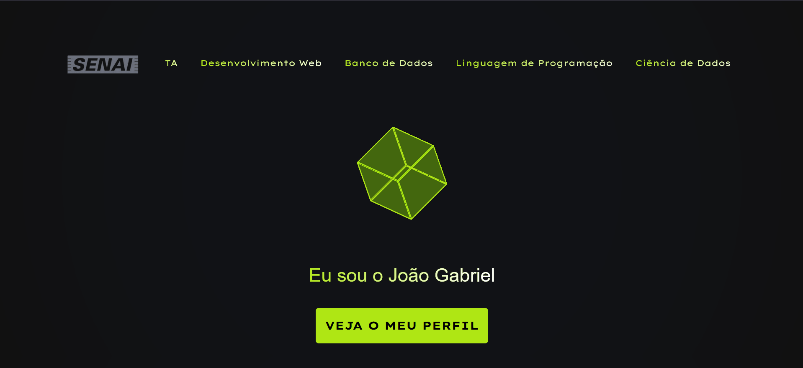

# PROJETO - PORTIFÓLIO




## FERRAMENTAS E VERSÕES
FERRAMETA: Visual Studio Code
FRAMEWORK: Bootstrap/4.5.2

## DESCRIÇÃO
Neste projeto criamos um portifólio onde testaram todos os nossos conhecimentos adquiridos em todas as
aulas dadas tanto de <b>AUTOMAÇÃO INDUSTRIAL, DESENVOLVIMENTO WEB, LINGUAGEM DE PROGRAMAÇÃO, BANCO DE DADOS E CIÊNCIA DE DADOS</b> utilizamos as linguagens padrão da web como <b>HTML,CSS E JAVASCRIPT</b> 

## instalação
```git clone https://github.com/H4ckta/Portifolio```

